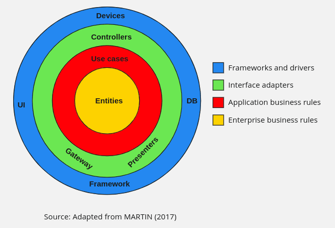

# Clean Architecture

A Clean Architecture, conceito popularizado por Robert C. Martin (também conhecido como Uncle Bob), é uma metodologia de design de software que visa minimizar as dependências de alto nível e manter o código organizado, testável e flexível. A arquitetura é dividida em camadas com responsabilidades bem definidas, o que permite uma maior manutenção e a possibilidade de substituir componentes sem afetar outras partes do sistema.

## Componentes da Clean Architecture

A Clean Architecture é composta pelas seguintes camadas:

1. **Entities**: São os objetos de domínio que encapsulam a lógica de negócios mais crítica da aplicação.
2. **Use Cases**: Contêm a lógica de negócios específica da aplicação e orquestram o fluxo de dados para e das entidades, direcionando esses dados para a camada de Interface de Usuário ou a camada de Infraestrutura.
3. **Interface Adapters**: Esta camada converte dados entre as formas mais convenientes para os use cases e entidades, e as formas mais convenientes para algum agente externo como o Banco de Dados ou a Web.
4. **Frameworks and Drivers**: Esta é a camada mais externa e geralmente consiste em frameworks e ferramentas como o Banco de Dados, o Web Framework, etc.




## Exemplo de Distribuição de Pacotes

Considere um projeto Java que implementa Clean Architecture. Aqui está uma possível estrutura de pacotes para esse projeto:

### Estrutura de Diretórios

```
src/
└── main/
    ├── java/
    │   └── com/
    │       └── minhaempresa/
    │           └── minhaaplicacao/
    │               ├── core/
    │               │   ├── domain/
    │               │   │   ├── User.java
    │               │   │   └── UserRepository.java
    │               │   ├── usecases/
    │               │   │   ├── UserUseCase.java
    │               │   │   └── UserInteractor.java
    │               │   └── ports/
    │               │       ├── UserService.java
    │               │       └── UserDataAccess.java
    │               ├── adapters/
    │               │   ├── controller/
    │               │   │   ├── UserController.java
    │               │   │   └── UserViewModel.java
    │               │   ├── repository/
    │               │   │   ├── UserRepositoryImpl.java
    │               │   │   └── DatabaseConnection.java
    │               └── config/
    │                   └── ApplicationConfig.java
    ├── resources/
    │   └── application.properties
    └── webapp/
        └── WEB-INF/
            └── web.xml
```

### Descrição dos Componentes

#### Core (Regras de Negócios)
- **`domain` (Entities)**: Contém as classes de entidades como `User`, que representam os objetos de negócio.
- **`usecases`**: Módulos como `UserUseCase` e `UserInteractor` que contêm a lógica de negócios e interagem diretamente com os objetos do domínio.
- **`ports`**: Interfaces como `UserService` (porta de entrada para os use cases) e `UserDataAccess` (porta de saída para a infraestrutura).

#### Adapters (Interface Adapters)
- **`controller`**: Adaptadores para a camada de interface de usuário, como `UserController`, que manipula dados entre a representação do usuário na web e o formato necessário para os use cases.
- **`repository`**: Implementações de `UserDataAccess`, como `UserRepositoryImpl`, que interagem com o banco de dados.

#### Frameworks and Drivers
- **`config`**: Configurações da aplicação e específicações do framework, como a inicialização do Spring ou outra infraestrutura de suporte.
- **`resources/application.properties`**: Propriedades externas e configurações do banco de dados.

## Benefícios da Clean Architecture

1. **Independência de Frameworks**: O sistema não depende da existência de uma biblioteca de software específica.
2. **Testabilidade**: A lógica de negócios pode ser testada sem a UI, o banco de dados, o servidor web ou qualquer outro elemento externo.
3. **Independência da UI**: A UI pode mudar facilmente, sem mudar o restante do sistema.
4. **Independência do Banco de Dados

**: É possível mudar o Oracle para SQL Server, por exemplo, sem mudar a lógica de negócios.
5. **Manutenibilidade**: A manutenção é mais fácil devido à separação clara das responsabilidades e desacoplamento das dependências.

Ao adotar a Clean Architecture, você facilita a escalabilidade, manutenibilidade e a flexibilidade do seu software, o que é crucial para aplicações empresariais complexas e de longo prazo.