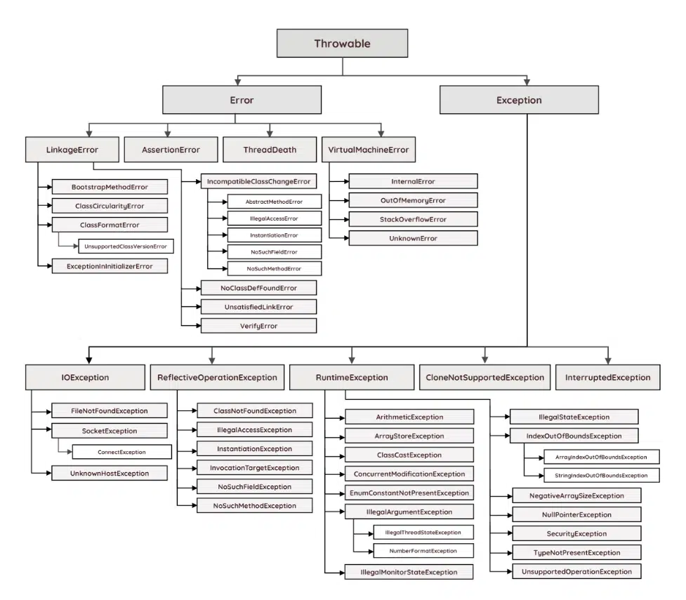

# Sintaxe Básica

## Lidando com Exceções em Java

### Controlando Exceções com Try, Catch e Finally

Em Java, exceções são maneiras de lidar com situações inesperadas que podem ocorrer durante a execução do seu programa. Vamos explorar como usar as estruturas try, catch e finally para manter o seu código robusto.

### Try: Tentativa de Execução
O bloco try é usado para envolver um trecho de código que pode lançar uma exceção. Você tenta executar esse código e, se uma exceção for lançada, você pode capturá-la e tratá-la.

### Catch: Capturando Exceções
O bloco catch é usado para capturar e tratar exceções que são lançadas dentro do bloco try. Você pode especificar o tipo de exceção que deseja capturar e, se essa exceção for lançada, o bloco catch correspondente será executado.

### Finally: Sempre Executando
O bloco finally é usado para escrever código que deve ser executado independentemente de uma exceção ter sido lançada ou não. Isso é útil para garantir que recursos, como arquivos ou conexões de banco de dados, sejam sempre fechados corretamente.

```java
try {
    // Código que pode lançar exceções
} catch (TipoDeExcecao1 e1) {
    // Tratamento para TipoDeExcecao1
} catch (TipoDeExcecao2 e2) {
    // Tratamento para TipoDeExcecao2
} finally {
    // Código a ser executado sempre
}
```

Exemplos:

```java
import java.util.Scanner;

public class CalculatorExample {
    public static void main(String[] args) {
        Scanner scanner = new Scanner(System.in);
        
        try {
            System.out.print("Enter numerator: ");
            int numerator = scanner.nextInt();
            
            System.out.print("Enter denominator: ");
            int denominator = scanner.nextInt();
            
            double result = divideNumbers(numerator, denominator);
            System.out.println("Result: " + result);
        } catch (ArithmeticException e) {
            System.out.println("Error: " + e.getMessage());
        } finally {
            scanner.close();
        }
    }
    
    public static double divideNumbers(int numerator, int denominator) {
        return (double) numerator / denominator;
    }
}
```

```java
import java.io.File;
import java.io.FileNotFoundException;
import java.util.Scanner;

public class FileReaderExample {

    public static void main(String[] args) {

        Scanner scanner = null;

        try {
            // Open the file for reading
            File file = new File("example.txt");
            scanner = new Scanner(file);

            // Read each line of the file
            while (scanner.hasNextLine()) {
                String line = scanner.nextLine();
                System.out.println(line);
            }

        } catch (FileNotFoundException e) {
            // Handle the exception if the file cannot be found
            System.out.println("File not found: " + e.getMessage());

        } finally {
            // Close the file and the scanner in the finally block
            if (scanner != null) {
                scanner.close();
            }
        }
    }
}
```

### Throws: Delegando Exceções

A palavra-chave throws é usada para declarar que um método pode lançar exceções específicas. Isso informa aos chamadores do método que eles precisam lidar com essas exceções ou propagá-las.

Exemplos: 

```java
import java.util.Scanner;

public class SquareRootCalculator {
    public static void main(String[] args) {
        Scanner scanner = new Scanner(System.in);
        
        try {
            System.out.print("Enter a number: ");
            double number = scanner.nextDouble();
            
            double result = calculateSquareRoot(number);
            System.out.println("Square root: " + result);
        } catch (IllegalArgumentException e) {
            System.out.println("Error: " + e.getMessage());
        } finally {
            scanner.close();
        }
    }
    
    public static double calculateSquareRoot(double number) throws IllegalArgumentException {
        if (number < 0) {
            throw new IllegalArgumentException("Negative numbers are not allowed.");
        }
        return Math.sqrt(number);
    }
}
```

```java
import java.io.File;
import java.io.FileNotFoundException;
import java.util.Scanner;

public class FileReaderExample {

    public static void main(String[] args) {
        try {
            readFileAndPrint("example.txt");
        } catch (FileNotFoundException e) {
            System.out.println("File not found: " + e.getMessage());
        }
    }

    public static void readFileAndPrint(String filename) throws FileNotFoundException {
        File file = new File(filename);
        Scanner scanner = new Scanner(file);

        while (scanner.hasNextLine()) {
            String line = scanner.nextLine();
            System.out.println(line);
        }

        scanner.close();
    }
}
```

### Throw: Lançando Exceções
A palavra-chave throw é usada para lançar uma exceção manualmente. Isso é útil quando você deseja indicar que algo está errado e deseja interromper a execução normal do código.

```java
import java.util.Scanner;

public class AgeValidator {
    public static void main(String[] args) {
        Scanner scanner = new Scanner(System.in);
        
        try {
            System.out.print("Enter your age: ");
            int age = scanner.nextInt();
            
            validateAge(age);
            System.out.println("Age is valid.");
        } catch (IllegalArgumentException e) {
            System.out.println("Error: " + e.getMessage());
        } finally {
            scanner.close();
        }
    }
    
    public static void validateAge(int age) throws IllegalArgumentException {
        if (age < 0 || age > 120) {
            throw new IllegalArgumentException("Invalid age. Age should be between 0 and 120.");
        }
    }
}
```

### Exceções Personalizadas

Você pode criar suas próprias exceções personalizadas, estendendo a classe Exception ou suas subclasses. Isso permite que você crie exceções que fazem sentido para o seu domínio específico.

Lidar com exceções é uma parte crucial da programação em Java. Usando try, catch e finally, você pode garantir que seu código seja capaz de lidar com erros de maneira elegante e que seu programa não seja interrompido abruptamente. Além disso, criar exceções personalizadas pode ajudar a expressar problemas específicos do seu domínio de maneira mais clara.

```java
class InsufficientFundsException extends Exception {
    public InsufficientFundsException(String message) {
        super(message);
    }
}

class BankAccount {
    private String accountNumber;
    private double balance;

    public BankAccount(String accountNumber, double balance) {
        this.accountNumber = accountNumber;
        this.balance = balance;
    }

    public void withdraw(double amount) throws InsufficientFundsException {
        if (amount > balance) {
            throw new InsufficientFundsException("Insufficient funds for account: " + accountNumber);
        }
        balance -= amount;
        System.out.println("Withdrawn " + amount + " from account: " + accountNumber + ". New balance: " + balance);
    }
}

public class BankExample {
    public static void main(String[] args) {
        BankAccount account = new BankAccount("123456", 1000.0);
        try {
            account.withdraw(500.0);
            account.withdraw(700.0);
        } catch (InsufficientFundsException e) {
            System.out.println(e.getMessage());
        }
    }
}
```

### Exceções Verificadas (Checked Exceptions)

- São exceções que o compilador requer que você trate ou declare.
- Estendem a classe `Exception` (direta ou indiretamente), mas não a classe `RuntimeException`.
- Exemplos incluem `IOException`, `FileNotFoundException`, `ParseException`.
- Você deve usar `try-catch` ou declarar a exceção no método que pode lançar uma exceção verificada.
- Usadas para indicar condições excepcionais que podem ocorrer durante a execução, como erros de entrada e saída ou análise de dados.

**Exemplo:**

```java
try {
    // Código que pode lançar uma exceção verificada
} catch (IOException e) {
    // Trata a exceção
}
```

#### Exceções Não Verificadas (Unchecked Exceptions)

- Também conhecidas como exceções de tempo de execução.
- Estendem a classe `RuntimeException`.
- Não exigem tratamento explícito ou declaração pelo compilador.
- Exemplos incluem `NullPointerException`, `ArrayIndexOutOfBoundsException`, `ArithmeticException`.
- Normalmente, são erros de programação e não devem ser capturados e tratados em tempo de execução, mas sim evitados por meio de uma programação cuidadosa.

**Exemplo:**

```java
int resultado = 10 / 0; // ArithmeticException: divisão por zero (exceção não verificada)
```

#### Quando Usar Cada Tipo

- Use exceções verificadas para condições excepcionais que seu código possa lidar, como erros de entrada e saída.
- Use exceções não verificadas para erros de programação que geralmente indicam bugs e não devem ser tratados no código (corrija o código em vez de capturar a exceção).

#### **Resumo**

| Tipo de Exceção        | Características                                           | Exemplos                                         |
|-------------------------|-----------------------------------------------------------|--------------------------------------------------|
| Exceções Verificadas    | - Requer tratamento ou declaração pelo compilador.<br> - Estendem `Exception` (não `RuntimeException`). | `IOException`, `ParseException`, etc.           |
| Exceções Não Verificadas| - Não requerem tratamento ou declaração explícita.<br> - Estendem `RuntimeException`.                | `NullPointerException`, `ArrayIndexOutOfBoundsException`, etc. |

Lembre-se de que o uso apropriado de exceções é uma parte importante do design de software em Java, e escolher entre exceções verificadas e não verificadas depende das circunstâncias específicas de seu programa.

