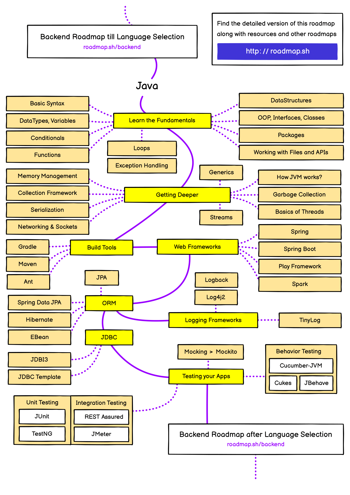

# 😎 Guia do Backend com Java 

Bem-vindo ao Guia do Backend! Este repositório é o ponto de partida perfeito para quem quer mergulhar no universo do desenvolvimento backend. Aqui, você encontrará uma série de arquivos recheados de conceitos, exemplos práticos e links úteis para o desenvolvimento.

## 🗺️ Roadmap

Gosto muito do site [roadmap.sh](https://roadmap.sh/), pois nele é possível encontrar trilhas e recursos valiosos para o aprendizado de diferentes áreas da TI.  Como pode ser visualizado na figura a seguir a trilha de backend e java abrange vários conceitos. 

Não se sinta pressionado a seguir cada passo desta trilha rigidamente. O desenvolvimento backend é uma jornada pessoal, e você pode adaptar seu percurso de acordo com seus interesses, necessidades e objetivos. Use este roadmap como uma bússola, mas sinta-se à vontade para explorar caminhos que despertem mais sua curiosidade.

### Roadmap Java

### Roadmap Backend

## 📚 Conteúdo:

### Java

#### Sintaxe Básica

- [Tipos de variáveis](./Java/Sintaxe%20Básica/1.%20Tipos-de-variáveis.md)
- [Operadores](./Java/Sintaxe%20Básica/2.%20Operadores.md)
- [Input](./Java/Sintaxe%20Básica/3.%20Input.md)
- [Anatomia das Classes](./Java/Sintaxe%20Básica/4.%20Anatomia-das-classes.md)
- [Convenções de Nomenclatura](./Java/Sintaxe%20Básica/5.%20Convenções-de-nomenclatura.md)
- [Arrays](./Java/Sintaxe%20Básica/6.%20Arrays.md)
- [Condicionais](./Java/Sintaxe%20Básica/7.%20Condicionais.md)
- [Estruturas de Repetição](./Java/Sintaxe%20Básica/8.%20Estruturas-de-Repetição.md)
- [Exceções](./Java/Sintaxe%20Básica/9.%20Exceções.md)
- [Generics](./Java/Sintaxe%20Básica/10.%20Generics.md)
- [Documentação](./Java/Sintaxe%20Básica/11.%20Documentação.md)
- [Palavras Reservadas](./Java/Sintaxe%20Básica/12.%20Palavras-Reservadas.md)
- [Testes com Assert](./Java/Sintaxe%20Básica/13.%20Assert.md)

## 🤝 Contribua!

Este guia está em constante crescimento, e sua contribuição é mais do que bem-vinda! Se você tem dicas, exemplos adicionais ou quer corrigir algo, sinta-se à vontade para abrir uma issue ou enviar um pull request. Vamos tornar este guia ainda mais incrível!

Divirta-se codificando! 🚀✨